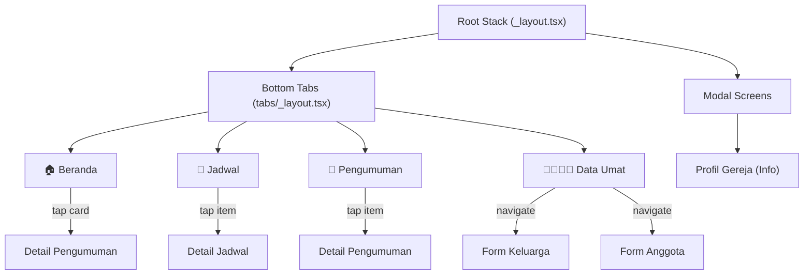

# SAPA UMAT — Development Plan (Frontend-Only)

Aplikasi mobile **SAPA UMAT** untuk **Gereja Katolik Santo Arnoldus Janssen Bekasi**.
Strategi tampilan (UI) saja — tanpa integrasi backend. Semua data ditampilkan menggunakan **static mock data** di dalam file JSON/TypeScript.

---

## Tech Stack yang Sudah Ada

| Item | Detail |
|---|---|
| Framework | Expo SDK 54 + React Native 0.81 |
| Routing | Expo Router v6 (file-based, tabs layout) |
| Animation | `react-native-reanimated` v4.1 |
| Icons | `@expo/vector-icons`, `IconSymbol` (SF Symbols) |
| Theme | Light/Dark mode via `useColorScheme` |

---

## Arsitektur Navigasi



**4 Bottom Tabs:**

| Tab | Icon | Screen File |
|---|---|---|
| Beranda | `house.fill` | `app/(tabs)/index.tsx` |
| Jadwal | `calendar` | `app/(tabs)/jadwal.tsx` |
| Pengumuman | `megaphone.fill` | `app/(tabs)/pengumuman.tsx` |
| Data Umat | `person.3.fill` | `app/(tabs)/data-umat.tsx` |

---

## Proposed Changes

### Phase 1: Foundation — Design System & Navigation

#### [MODIFY] [theme.ts](file:///Users/indra/project/sapa-umat/constants/theme.ts)
- Tambah palet warna khas Gereja Katolik (burgundy/maroon `#800020`, emas `#C5922E`, putih, abu gelap)
- Tambah spacing, border-radius, dan shadow tokens
- Tambah typography scale (heading, subheading, body, caption)

#### [NEW] [mock-data.ts](file:///Users/indra/project/sapa-umat/constants/mock-data.ts)
- Static data untuk seluruh fitur: jadwal misa, pengumuman, info gereja, dan data keluarga contoh
- Berisi array of objects dengan tipe TypeScript yang jelas

#### [NEW] [types.ts](file:///Users/indra/project/sapa-umat/constants/types.ts)
- TypeScript interfaces: `JadwalMisa`, `Pengumuman`, `InfoGereja`, `Keluarga`, `AnggotaKeluarga`, `Lingkungan`, `Wilayah`

#### [MODIFY] [_layout.tsx (tabs)](file:///Users/indra/project/sapa-umat/app/(tabs)/_layout.tsx)
- Ubah dari 2 tab menjadi 4 tab: Beranda, Jadwal, Pengumuman, Data Umat
- Gunakan warna tema baru, styling tab bar custom

#### [MODIFY] [_layout.tsx (root)](file:///Users/indra/project/sapa-umat/app/_layout.tsx)
- Tambah stack screens untuk detail pages dan form pages

#### [DELETE] [explore.tsx](file:///Users/indra/project/sapa-umat/app/(tabs)/explore.tsx)
- Hapus halaman Explore bawaan template

---

### Phase 2: Reusable Components

#### [NEW] [card.tsx](file:///Users/indra/project/sapa-umat/components/ui/card.tsx)
- Card component dengan shadow, border-radius, support untuk gambar header

#### [NEW] [section-header.tsx](file:///Users/indra/project/sapa-umat/components/ui/section-header.tsx)
- Judul section + "Lihat Semua" link

#### [NEW] [badge.tsx](file:///Users/indra/project/sapa-umat/components/ui/badge.tsx)
- Label kategori berwarna (Misa, Adorasi, Ibadat, dsb)

#### [NEW] [schedule-item.tsx](file:///Users/indra/project/sapa-umat/components/ui/schedule-item.tsx)
- Baris jadwal: icon waktu, judul misa, lokasi, hari

#### [NEW] [announcement-card.tsx](file:///Users/indra/project/sapa-umat/components/ui/announcement-card.tsx)
- Card pengumuman dengan gambar, judul, tanggal, kategori badge

#### [NEW] [info-row.tsx](file:///Users/indra/project/sapa-umat/components/ui/info-row.tsx)
- Row dengan icon + label + value untuk informasi gereja

#### [NEW] [form-field.tsx](file:///Users/indra/project/sapa-umat/components/ui/form-field.tsx)
- Input field dengan label, placeholder, validasi visual, dan dropdown picker

#### [NEW] [button.tsx](file:///Users/indra/project/sapa-umat/components/ui/button.tsx)
- Primary/secondary/outline button dengan loading state

#### [NEW] [header-banner.tsx](file:///Users/indra/project/sapa-umat/components/header-banner.tsx)
- Hero banner dengan gambar gereja, gradient overlay, nama gereja

---

### Phase 3: Beranda (Home Screen)

#### [MODIFY] [index.tsx](file:///Users/indra/project/sapa-umat/app/(tabs)/index.tsx)
Redesign total halaman utama, isi:

1. **Hero Banner** — Gambar/ilustrasi Gereja SAJ Bekasi dengan gradient overlay, nama gereja, dan kutipan ayat
2. **Quick Action Grid** — 4 shortcut icon (Misa Hari Ini, Info Gereja, Pengumuman Terbaru, Data Umat)
3. **Jadwal Misa Minggu Ini** — Horizontal scroll card ringkas (max 3 item), tombol "Lihat Semua"
4. **Pengumuman Terbaru** — Vertical list card 2–3 pengumuman terakhir
5. **Info Singkat Gereja** — Alamat, telepon, jam operasional sekretariat

---

### Phase 4: Jadwal Ibadah

#### [NEW] [jadwal.tsx](file:///Users/indra/project/sapa-umat/app/(tabs)/jadwal.tsx)
Tampilan utama jadwal ibadah dengan:

1. **Filter Tabs** — Semua / Misa / Adorasi / Ibadat / Kegiatan Khusus
2. **Jadwal Mingguan** — Grouped by hari (Senin–Minggu), setiap item menampilkan waktu, jenis ibadah, bahasa misa, lokasi (Gereja Utama / Kapel), celebran
3. **Jadwal Khusus** — Section terpisah untuk Misa Hari Raya, Pembaptisan, Perkawinan, Krisma
4. **Info Tambahan** — Catatan penting (misal: pendaftaran misa online, kuota misa)

#### [NEW] [jadwal-detail.tsx](file:///Users/indra/project/sapa-umat/app/jadwal-detail.tsx)
- Detail lengkap satu jadwal: deskripsi, celebran, catatan, lokasi map placeholder

---

### Phase 5: Informasi Gereja

#### [NEW] [info-gereja.tsx](file:///Users/indra/project/sapa-umat/app/info-gereja.tsx)
Modal/stack screen berisi:

1. **Profil Paroki** — Nama lengkap, Pelindung, Sejarah singkat, Pastor Paroki, Vikaris
2. **Struktur Organisasi** — Dewan Pastoral Paroki, Seksi-seksi
3. **Kontak & Alamat** — Alamat, telepon, email, website, map placeholder
4. **Wilayah & Lingkungan** — Daftar wilayah dan lingkungan dalam paroki
5. **Galeri** — Placeholder grid foto gereja

---

### Phase 6: Pengumuman

#### [NEW] [pengumuman.tsx](file:///Users/indra/project/sapa-umat/app/(tabs)/pengumuman.tsx)
1. **Search Bar** — Pencarian pengumuman (filter lokal dari mock data)
2. **Filter Kategori** — Chips: Semua, Liturgi, Kegiatan, Sakramen, Sosial
3. **List Pengumuman** — Card list dengan gambar, judul, tanggal, ringkasan, badge kategori
4. **Pull-to-Refresh** — Animasi refresh (simulasi, tanpa real API)

#### [NEW] [pengumuman-detail.tsx](file:///Users/indra/project/sapa-umat/app/pengumuman-detail.tsx)
- Halaman detail: gambar besar, judul, tanggal, konten lengkap, tombol share placeholder

---

### Phase 7: Data Umat — BASIS (Basis Integrasi Data Umat Keuskupan)

> [!IMPORTANT]
> Ini adalah fitur **pengisian formulir data keluarga** sesuai format BASIS Keuskupan. Tanpa backend, data hanya ditampilkan di UI dan disimpan di local state. Struktur data mengikuti standar Keuskupan.

#### [NEW] [data-umat.tsx](file:///Users/indra/project/sapa-umat/app/(tabs)/data-umat.tsx)
Dashboard Data Umat:

1. **Header** — "Basis Integrasi Data Umat Keuskupan" + logo/icon
2. **Ringkasan Data** — Statistik card: jumlah keluarga terdaftar, jumlah jiwa, jumlah lingkungan (mock)
3. **Daftar Keluarga** — Searchable list kartu keluarga katolik (Nama KK, No. KK Katolik, Lingkungan, Wilayah)
4. **FAB (Floating Action Button)** — Tombol "Tambah Keluarga Baru"

#### [NEW] [form-keluarga.tsx](file:///Users/indra/project/sapa-umat/app/form-keluarga.tsx)
Form multi-step pengisian data keluarga:

**Step 1 — Data Keluarga:**
- No Kartu Keluarga Katolik
- Nama Kepala Keluarga
- Alamat lengkap (Jalan, RT/RW, Kelurahan, Kecamatan, Kota, Kode Pos)
- Lingkungan, Wilayah, Paroki (dropdown)
- Status tempat tinggal (Milik Sendiri / Kontrak / Lain-lain)
- No. Telepon

**Step 2 — Anggota Keluarga:**
- List anggota yang sudah ditambahkan
- Tombol "Tambah Anggota" → navigasi ke form anggota

**Step 3 — Review & Konfirmasi:**
- Summary semua data
- Tombol "Simpan" (simpan ke local state, tampilkan toast sukses)

#### [NEW] [form-anggota.tsx](file:///Users/indra/project/sapa-umat/app/form-anggota.tsx)
Form pengisian data satu anggota keluarga sesuai standar BASIS:

- Nama Lengkap
- Nama Panggilan / Baptis
- Tempat & Tanggal Lahir
- Jenis Kelamin
- Hubungan dalam Keluarga (KK / Istri / Anak / Lainnya)
- Status Pernikahan (Belum Menikah / Katolik / Campur / Sipil / Adat)
- Golongan Darah
- Pendidikan Terakhir
- Pekerjaan
- **Data Sakramen:**
  - Baptis (Tanggal, Gereja, No. Surat)
  - Komuni Pertama (Tanggal, Gereja)
  - Krisma (Tanggal, Gereja)
  - Pernikahan (Tanggal, Gereja, Buku/No)
- Status Keanggotaan (Aktif / Pindah / Meninggal)

---

### Phase 8: Polish & Finishing

#### Animasi & Micro-interactions
- Fade-in saat screen mount (`react-native-reanimated`)
- Card press scale animation
- Smooth tab transition
- Skeleton loader placeholder untuk simulasi loading

#### Aset Visual
- Generate hero image gereja menggunakan `generate_image` tool
- Icon-icon custom jika diperlukan
- Splash screen dengan branding SAPA UMAT

---

## Struktur File Akhir

```
app/
├── _layout.tsx                    # Root Stack
├── modal.tsx                      # Modal screen
├── info-gereja.tsx                # Info Gereja (stack)
├── jadwal-detail.tsx              # Detail Jadwal (stack)
├── pengumuman-detail.tsx          # Detail Pengumuman (stack)
├── form-keluarga.tsx              # Form Keluarga multi-step
├── form-anggota.tsx               # Form Anggota Keluarga
└── (tabs)/
    ├── _layout.tsx                # 4 Bottom Tabs
    ├── index.tsx                  # Beranda
    ├── jadwal.tsx                 # Jadwal Ibadah
    ├── pengumuman.tsx             # Pengumuman
    └── data-umat.tsx              # Data Umat (BASIS)

components/
├── header-banner.tsx              # Hero banner
├── ui/
│   ├── card.tsx                   # Card
│   ├── section-header.tsx         # Section header
│   ├── badge.tsx                  # Kategori badge
│   ├── schedule-item.tsx          # Baris jadwal
│   ├── announcement-card.tsx      # Card pengumuman
│   ├── info-row.tsx               # Row info
│   ├── form-field.tsx             # Input field
│   └── button.tsx                 # Button
│   (existing: collapsible, icon-symbol)

constants/
├── theme.ts                       # Extended color palette + tokens
├── types.ts                       # TypeScript interfaces
└── mock-data.ts                   # Static mock data
```

---

## Verification Plan

### Visual Testing (Browser / Device)
Karena ini project frontend-only tanpa unit test, verifikasi dilakukan secara visual:

1. **Jalankan aplikasi** dengan `npm run android` (sudah berjalan) atau `npx expo start`
2. **Cek setiap tab** — pastikan 4 tab muncul dan navigasi bekerja
3. **Cek navigasi detail** — tap card pengumuman / jadwal → halaman detail terbuka
4. **Cek form DATA UMAT** — scroll seluruh form, isi data, navigasi multi-step
5. **Cek dark mode** — toggle tema device, pastikan semua screen responsif
6. **Cek animasi** — fade-in, card press, parallax scroll berjalan smooth

### Manual Checklist untuk User
Setelah implementasi selesai, user diminta mengecek:
- [ ] Beranda menampilkan hero, quick actions, jadwal ringkas, pengumuman terbaru
- [ ] Tab Jadwal menampilkan daftar jadwal misa dengan filter
- [ ] Tab Pengumuman menampilkan list pengumuman dengan search dan filter
- [ ] Tab Data Umat menampilkan dashboard dan daftar keluarga
- [ ] Form pengisian data keluarga dan anggota berfungsi secara UI
- [ ] Dark mode bekerja di semua screen
- [ ] Navigasi antar screen lancar tanpa error

---

## Dependencies Tambahan (Opsional)

| Package | Kegunaan | Wajib? |
|---|---|---|
| `@expo/vector-icons` | Icons (sudah ada) | ✅ Sudah ada |
| `expo-linear-gradient` | Gradient overlay pada hero banner | Opsional |
| `react-native-reanimated` | Animasi (sudah ada) | ✅ Sudah ada |
| Tidak ada package baru wajib | — | — |

> [!NOTE]
> Plan ini fokus pada **strategi tampilan (UI) saja**. Semua data bersifat static/mock. Jika di masa depan ingin integrasi backend (Firebase, Supabase, REST API), arsitektur sudah siap — cukup ganti mock data dengan API calls.
